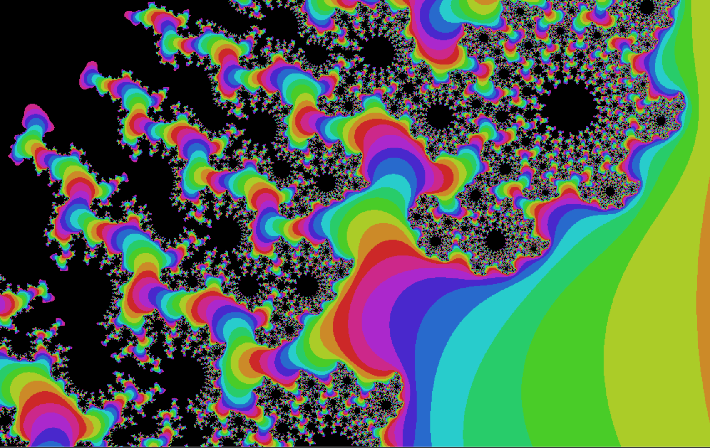

# Mandelbrot Explorer

A real-time Mandelbrot set visualization with automatic focus tracking, designed as a rolling exhibition demo that runs unattended. The system continuously zooms into visually interesting regions of the fractal, creating an endlessly captivating display.



## What is the Mandelbrot Set?

The Mandelbrot set is one of the most famous objects in mathematics – a fractal that reveals infinite complexity at every scale. It is defined by a deceptively simple rule: for each point *c* in the complex plane, iterate the function *z → z² + c* starting from *z = 0*. If the sequence remains bounded (doesn't escape to infinity), the point belongs to the Mandelbrot set.

The boundary of this set produces the iconic images we associate with fractals: intricate spirals, seahorse tails, and self-similar structures that repeat endlessly as you zoom in. Each zoom level reveals new patterns, yet the same fundamental shapes reappear at different scales – a property called self-similarity.

This program visualizes the set by coloring each pixel based on how quickly its corresponding point escapes to infinity. Points inside the set (which never escape) are colored black, while points outside receive colors based on their escape velocity, creating the vibrant bands that make Mandelbrot visualizations so visually striking.

## Getting Started

### Prerequisites

You need Rust installed on your system. If you don't have it yet, install it using rustup:

**Windows:**
1. Download and run [rustup-init.exe](https://rustup.rs/)
2. Follow the on-screen instructions
3. Restart your terminal

**Linux and macOS:**
```bash
curl --proto '=https' --tlsv1.3 https://sh.rustup.rs -sSf | sh
```

In both cases, you will wind up with mainly three programs:
- **rustup**: This is the installer and updater.
- **rustc**: This is the core compiler of the Rust language. You will rarely interface with it directly.
- **cargo**: This program contains the package manager (something like PiPy in Python) and a complete build system.
  This program is the central entry to the Rust world.

### Building and Running

Clone the repository and build in release mode (important for performance!):

```bash
git clone https://github.com/Carbonfreezer/Mandelbrot-Explorer.git
cd Mandelbrot-Explorer
cargo run --release
```

The `--release` flag is crucial - debug builds are roughly 10x slower due to missing optimizations.

The application launches in fullscreen mode. Press `Alt+F4` to exit.

## How It Works

### Variance-Based Autofocus

The key challenge for an unattended exhibition demo is automatically finding visually interesting regions to explore. This implementation uses a variance-based autofocus strategy:

1. **Variance Calculation**: For each pixel, we compute the statistical variance of iteration counts in an 11×11 window around it. High variance indicates areas where the escape behavior changes rapidly – the boundaries and filaments that make Mandelbrot visualizations interesting.

2. **Center Bias**: To prevent the camera from drifting to corners, each candidate point receives a score that combines its variance with a bias toward the screen center. Points near the center need less variance to be selected than points at the edges.

3. **Smooth Camera Movement**: Instead of jumping directly to the highest-scoring point, the camera uses a critically damped spring system (smooth damp). This creates fluid, organic movement that gradually gravitates toward interesting regions rather than jittering between candidates.

The combination produces natural-looking exploration: the view smoothly follows branching structures, spirals along filaments, and discovers new detail as it zooms deeper into the fractal.

### State Machine

The system operates in three states:
- **Start Zooming**: Zoom in on the chosen point without autofocus adjustment.
- **Zooming In And Following**: Normal operation, following the autofocus while continuously zooming
- **Zooming Out**: When precision limits are reached, smoothly zoom back out
- **Panning**: At the base zoom level, smoothly pan to a new randomly-selected interesting location

This creates seamless transitions between exploration sites without jarring cuts.

## Parallelization with Rayon

Mandelbrot calculation is embarrassingly parallel – each pixel can be computed independently. This project uses [Rayon](https://github.com/rayon-rs/rayon), a data parallelism library for Rust, to distribute work across all available CPU cores.

The parallelization is remarkably simple. Converting sequential code:

```rust
let results: Vec<u16> = (0..width * height)
    .map(|i| calculate_pixel(i))
    .collect();
```

To parallel code:

```rust
use rayon::prelude::*;

let results: Vec<u16> = (0..width * height)
    .into_par_iter()  // This is the only change!
    .map(|i| calculate_pixel(i))
    .collect();
```

Rayon automatically handles thread pool management, work stealing, and load balancing. On an 8-core machine, this provides roughly 4-6x speedup with essentially zero code complexity.

## Performance

On a modern laptop with 8 cores:
- Resolution: 1280×720
- Frame rate: ~50 FPS in release mode
- Smooth zooming until floating-point precision limits (~10⁻¹³)

## License

[MIT License](LICENSE) – feel free to use, modify, and share.

## Acknowledgments

- The Mandelbrot set, discovered by Benoît Mandelbrot in 1980
- [Macroquad](https://macroquad.rs/) for the simple graphics framework
- [Rayon](https://github.com/rayon-rs/rayon) for effortless parallelization
